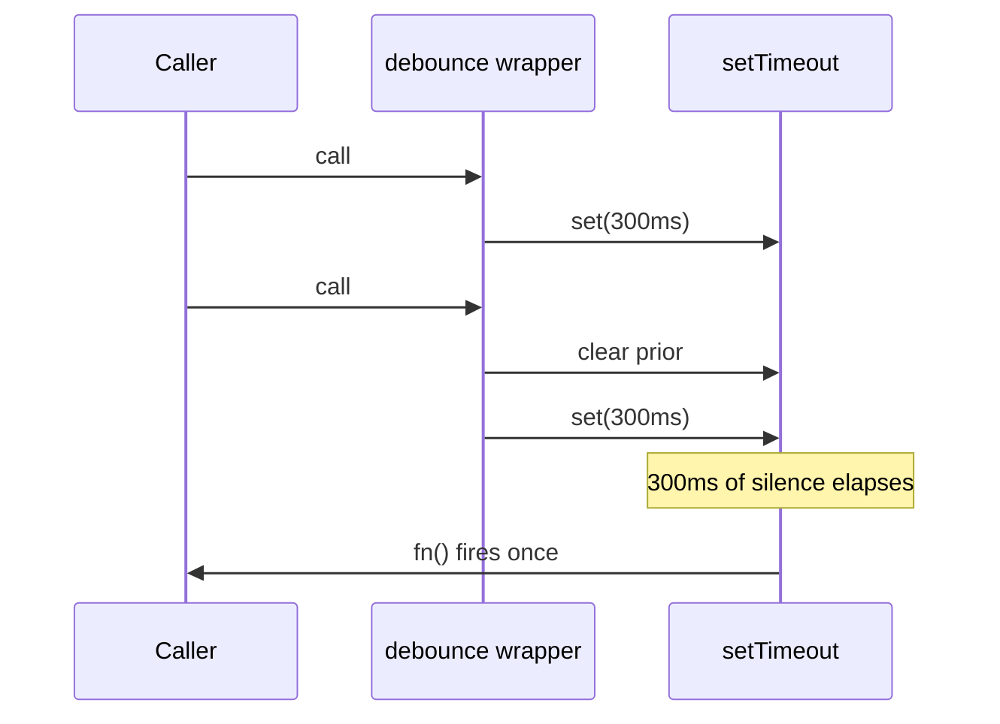

# Codebase Narrator

Generate developer-perspective walkthroughs of codebases. The output should read like a developer's internal monologue — not a tutorial, not documentation, but the messy, iterative, "wait-what-if" stream of thought that happens when someone is actually building something.

## When to Activate

Use this skill when the user asks you to:
- Explain how a codebase was built or how a developer would think about it
- Create a walkthrough, narration, or "developer diary" of existing code
- Teach a beginner by showing the thought process, not just the syntax
- Break down a project into the mental steps a developer took

## Output Format

Structure the walkthrough as an **artifact** (markdown document) with these sections:

### 1. The Problem Statement (Act 1)
- Open with the developer asking themselves: "What am I even building?"
- Frame the goal in plain language, no jargon
- List the approaches the developer considered and why they picked the one they did
- Use first-person inner monologue: *"First question I ask myself..."*, *"Two approaches come to mind..."*

### 2. The Architecture (Act 2)
- Explain the high-level structure using ASCII diagrams or tables
- Show how the pieces fit together BEFORE diving into code
- Narrate the developer's reasoning: why these layers, why this separation

### 3. Complete Code Walkthrough (Main Acts)
Walk through every **meaningful source** file, in the order a developer would build them. "Meaningful source" is hand-written logic that a developer actually reasoned about.

**Skip unless explicitly asked:**
- Generated code: build output, compiled bundles, `*.min.js`, generated migrations, protobuf/grpc stubs, OpenAPI client codegen
- Vendored/third-party: `node_modules/`, `vendor/`, `Pods/`, `third_party/`, anything under a lockfile-driven cache
- Lockfiles & manifests of deps: `package-lock.json`, `yarn.lock`, `pnpm-lock.yaml`, `Cargo.lock`, `go.sum`, `Gemfile.lock`, `poetry.lock`
- Trivial files: empty barrels/re-exports, pure type re-exports, config files with no logic (`.gitignore`, `.editorconfig`), license files
- Data/assets: `.json`/`.csv`/`.sql` fixtures, images, fonts

For each **skipped** file that a beginner might wonder about, drop one line in the walkthrough naming it and why it's skipped (e.g. *"package-lock.json — pins exact dependency versions, machine-generated, no developer reasoning to narrate"*). Never narrate skipped files line-by-line.

If the codebase is too large to cover in one artifact, narrate the entry point + the files on the critical path first, then say *"…and N more files follow the same pattern; say the word and I'll narrate the next batch."* Do not silently truncate. For each file:

- **Open with the developer's thought** in a blockquote: *"Before I write any logic, I need a clean slate."*
- **Show the code in annotated blocks** with inline comments explaining:
  - WHAT the line does (for beginners who may not know the API)
  - WHY it was done this way (the reasoning, trade-offs, alternatives rejected)
  - Common GOTCHAS the developer knows from experience
- **Group related lines** into logical steps (e.g., "STEP 1: Create the gradient", "STEP 2: Draw the wobbly shape")
- **Use tables** to summarize collections of values (constants, parameters, options)

#### Comment Style Rules
- Every comment must start with WHY or WHAT, never just restate the code
- Use conversational tone: *"WHY: We don't want ANY scrollbars..."*
- Include the developer's experiential knowledge: *"I know from past pain that..."*
- Call out non-obvious connections: *"This matches the MASK_COLOR constant so there's no visible seam"*
- For math/algorithms, show concrete examples with actual numbers:
  ```
  t=0.0 -> ease=0.000  (hasn't started growing)
  t=0.2 -> ease=0.488  (already almost half size)
  ```

### 4. Flow Diagram
Include a Mermaid sequence or flow diagram showing the runtime behavior. Rules:
- **NEVER use Mermaid reserved keywords as participant IDs.** Reserved keywords include: `loop`, `alt`, `opt`, `par`, `end`, `rect`, `critical`, `break`, `else`. If a function or concept matches a reserved word (e.g., a function called `loop`), use a different internal ID with a display alias. Example: `participant RenderLoop as loop` instead of `participant Loop as loop`.
- Quote participant names that contain special characters like parentheses
- Avoid parentheses, equals signs, and HTML tags (like `<br/>`) in arrow labels and notes
- Use descriptive labels on arrows
- Add notes for important state changes

### 5. Constants / Config Table
Create a table with every tunable value and the developer's reasoning:

| Constant | Value | Developer's reasoning |
|----------|-------|----------------------|
| NAME     | value | "Why I picked this, in quotes, conversational" |

Emphasize that these values were tuned by feel, not calculated mathematically (when that's the case).

### 6. Concepts Cheat Sheet (for beginners)
A summary table of every technical concept used in the project:

| Concept | What it means | Where it's used |
|---------|---------------|-----------------|

### 7. TL;DR
One-sentence summary of the entire project's trick/mechanism, formatted as a blockquote.

## Voice and Tone Rules

1. **First person, present tense**: Write as if the developer is building it RIGHT NOW. *"Alright, so I need..."*, *"The fix is..."*
2. **No textbook language**: Never say "In this section we will learn..." or "The following code demonstrates...". Say *"This is the artistic core"* or *"This is where all the magic happens."*
3. **Show the mess**: Include the rejected ideas, the trade-offs, the "this felt right" tuning. Real development isn't clean.
4. **Blockquote developer thoughts** before each file section: use `>` quotes for the developer's internal motivation for what they're about to build.
5. **Use "Acts" not "Sections"**: Structure the walkthrough like a story with acts, not a textbook with chapters.
6. **No emojis in code comments**: Keep inline code comments clean and professional. Emojis are fine in section headers.
7. **Link to actual files**: Use repo-relative markdown links `[filename](./src/foo.ts)` when referencing project files. Prefer repo-relative paths (relative to the repo root) over absolute `file:///` URLs — relative links render correctly on GitHub, in IDE preview, in containers, and when the repo is cloned anywhere, whereas `file:///` only works on the author's machine and breaks in remote/CI contexts. Use `[filename](./path#L42-L58)` to point at specific line ranges.
8. **Tables over paragraphs**: When explaining collections of things (constants, concepts, parameters), always prefer tables over prose.

## Quality Checklist

Before finalizing the walkthrough, verify:
- [ ] Every meaningful source file is covered (generated/vendored/lockfiles skipped per the rules above)
- [ ] Every non-trivial line has a WHY comment, not just a WHAT comment
- [ ] The developer's decision-making process is visible (alternatives considered, trade-offs made)
- [ ] Beginners can follow without prior knowledge of the specific APIs used
- [ ] Mermaid diagrams render correctly (participant names with special chars are quoted)
- [ ] Constants are explained with the developer's experiential reasoning, not just definitions
- [ ] The tone reads like a person thinking out loud, not a manual

## Example Output (anchor for voice/style)

A miniature walkthrough of a 6-line debounce util. Real output follows this voice — first person, present tense, WHY-over-WHAT, "show the mess." Keep this short; it's a style anchor, not a template to copy literally.

---

### The Problem Statement (Act 1)

> "Okay — what am I even building?" A button fires its handler on every keystroke and hammers the API. I don't need the handler to run on *every* keystroke, I need it to run *after the user stops typing*. Two options come to mind: throttle (fire at most every N ms) or debounce (fire once after N ms of silence). For "search-as-you-type" throttle feels wrong — I'd still send mid-word requests the user didn't intend. Debounce is the right call: wait for quiet, then fire.

### The Architecture (Act 2)

```
caller ──(many rapid calls)──▶ debounce(fn, 300) ──▶ setTimeout
                                   │                    │
                                   └── clears prior ────┘
                                        timer on each call
                                                          │
                            (after 300ms of silence) ─────┴──▶ fn() runs once
```

One layer: a closure holding a timer id. No state object, no class — overkill for this.

### Complete Code Walkthrough

> *"Before I write any logic, I need to remember the timer between calls. A closure is the lightest thing that does that."*

File: [`debounce.ts`](./src/debounce.ts)

```ts
// STEP 1: Return a wrapper that defers the real call
export function debounce<T extends (...args: any[]) => void>(fn: T, ms: number) {
  // WHY: a generic <T> keeps the caller's arg types flowing through — without it,
  //      TypeScript widens everything to any[] and downstream code loses type safety.
  let timer: ReturnType<typeof setTimeout> | null = null;
  // WHY: ReturnType<typeof setTimeout> instead of number — on the browser this is
  //      a number, in Node it's a Timeout object. The generic adapts to whichever
  //      runtime without a type lie. Gotcha: declaring it `null` up front so the
  //      first call's clear() is a no-op rather than clearing a stranger's timer.

  return (...args: Parameters<T>) => {
    // WHY: Parameters<T> mirrors fn's arg tuple, so the debounced wrapper has the
    //      EXACT same signature as fn. Callers get autocomplete, no `any`.
    if (timer) clearTimeout(timer);
    // WHY: this is the whole trick — every fresh call cancels the pending fire.
    //      Net effect: only the LAST call in a burst ever actually runs.
    timer = setTimeout(() => fn(...args), ms);
    // WHY: arrow function, not `function`, so `this` isn't rebound — though I'm
    //      not using `this` here, a caller might pass a method and I don't want
    //      to silently break them. Rejected alternative: `setTimeout(fn, ms, ...args)`
    //      is shorter, but loses control over `this` binding. Not worth the saving.
  };
}
```

| Constant | Value | Developer's reasoning |
|----------|-------|----------------------|
| `ms` | caller-supplied (e.g. 300) | "I refused to hardcode this — 300ms feels right for search, 1000ms for autosave. One-size-fits-none." |
| `null` (initial timer) | `null` | "So the first `clearTimeout` is harmless instead of clearing an unrelated id." |

### Flow Diagram



> `Timer` aliased because `setTimeout` contains parens — quoting/aliasing keeps the diagram render-safe.

### Concepts Cheat Sheet

| Concept | What it means | Where it's used |
|---------|---------------|-----------------|
| Closure | A function that remembers variables from where it was defined | `timer` persists across calls |
| Generic `<T>` | A type parameter filled in by the caller | preserves `fn`'s arg types |
| `ReturnType<typeof X>` | "whatever X returns, use that type" | adapts timer id across runtimes |

### TL;DR

> Debounce = "cancel the previous pending call on every new call, so only the last call in a burst ever actually runs" — the whole trick is one `clearTimeout` before each `setTimeout`.

---

**Note for the agent:** The example above is deliberately tiny (one 6-line file). Scale the structure — not the verbosity — to the real codebase. A 60-file project still gets one tight Problem Statement, one Architecture diagram, then per-file walkthroughs of the same density as above; do not pad.
